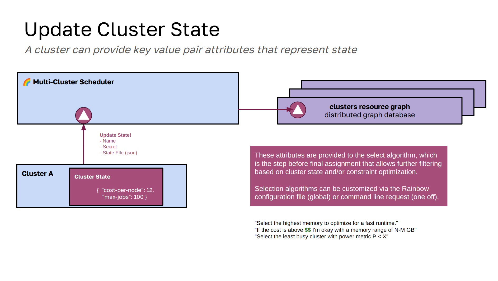

# Designs

## Rainbow Scheduler

### 1. Prepare to Register

To register to the rainbow scheduler, a cluster needs to prepare a JGF graph (json graph format, version 2) of its nodes. While this can be done with any method suitable to the cluster, we have an [extract command](https://github.com/compspec/compspec-go/tree/main/docs/rainbow#example) in compspec that is able to run on each node and then combine the extracted metadata into one. This process is shown in the diagram above in the middle section with `flux run -N3 compspec...` to represent running this command across a few nodes. The result is the cluster resource graph.

This cluster resource graph can then be given to rainbow, which should validate it, and then read it into the graph database. Note that the graph databases in rainbow are interfaces, meaning that multiple can be supported, and it comes down to changing a string for the setting in the configuration file used to start the server.

### 2. Registration

This image extends the first one to show the relationship between rainbow and the graph database. While rainbow receives the registration request and adds the cluster to its small database, the actual graph database that holds the nodes is separate and distributed. Currently this means that graph database interfaces must implement functions that support interaction with the database via GRPC and similar. Currently, since the in-memory graph database (default) is served by rainbow, although it is also exposed via GRPC, it is technically speaking running on the same server, and thus handling authentication. For future, more robust graph databases, in that the rainbow client is interacting directly with them via GRPC (and no rainbow server interaction) we will need to have authentication and authorization represented there. Note that during registration, two things are returned to the cluster:

- **token**: is a token that allows someone to submit work to the cluster. More specifically, someone doing a submit request from anywhere else can provide this token, and the cluster it is associated with can be considered
- **secret**: is a secret that is required for further interaction of the cluster with rainbow, which currently includes accepting jobs and registering subsystems.

This steps also stores summary metrics for the cluster at the top level of the graph (e.g., total nodes, cores) as a "quick check" hieuristic for the search. We don't have to search clusters that can't satisfy the total resources from the get go.

### 3. Subsystem Registration

A subsystem registration is similar conceptually to a regular registration, except we assume the cluster dominant subsystem (the cluster and nodes) to already exist, and thus require the secret In this step. In the same way that summary metrics are kept for the cluster, summary metrics are kept for the subsystem. For a subsystem, we require that every node in the subsystem is either related to another subsystem vertex, OR that it references a vertex in the dominant subsystem (e.g., a physical node has some IO available). We currently keep them under separate roots (e.g., dominant subsystem is "cluster" and clusters like "Cluster A" goes off of that, as shown above) and then the io subsystem has its own root (also with "Cluster A") and those are connected via edges.

The connections (edges) between dominant subsystem and subsystem nodes are bidirectional, and this is done for two reasons:

1. When traversing the dominant subsystem looking for matches, we rely on the edges that point to the subsystem resource to determine if a need is satisfied.
2. The opposite edge is (will be, not implemented yet) used for a cleanup, or going through the subsystem graph, finding nodes that are linked to, deleting the opposing edge, and then the entire subsystem graph.

### 4. Update State

Optionally, a cluster can submit state information to the submit state information endpoint.  These key value pairs should represent a cluster's current state, and can range from costs to power to how occupied the cluster is.

These attributes are provided to the select algorithm, which is the step before final assignment that allows further filtering based on cluster state and/or constraint optimization. Selection algorithms can be customized via the Rainbow configuration file (global) or command line request (one off).

### 5. Submit Work

Submitting work comes down to the client providing a request, having the request transformed into a Jobspec, and then sent to the cluster resource graph. When we say "transformed into Jobspec" this means that, although the client can provide a jobspec directly with `--jobspec`, it's more likely they will provide another format that can be translated. Formats include (but are not limited to):

- An explicit Jobspec
- A Kubernetes object (not developed yet)
- A simple definition of nodes, cores, gpus, and a command

We likely will be designing other abstractions to define the work, which is not done yet.  Note that this interaction to find clusters that can satisfy the request is only done between the client and graph database, and this is done intentionally to not stress the rainbow cluster server, which should only handle receiving the final assignments and interaction with clusters. This also means we eventually need authentication just on the level of the graph database, which currently isn't an issue because the in-memory graph databsase is served by rainbow, and although it uses the same "separate GRPC" approach, this means it can use the same check for credentials as rainbow uses. We likely want some ability as well for rainbow to verify that the request was seen/approved by the graph database, but I haven't thought that far yet. This is the step that uses the graph database backend to do traversal and determine if the request can be satisfied by one or more clusters. You can read about algorithms for that [here](algorithms.md).

### 6. Assign Work

When some number of clusters are found, a match algorithm (1) is first used to filter down the set further, where the algorithm operates on the level of slots defined by the Jobspec, and defines rules for how subsystem metadata at that slot should be used. As an example, the user might require a particular kind of storage to exist at a slot, and so the algorithm would check if a subsystem edge for that storage type is connected to a node. After match the request and set of clusters are sent to rainbow, which authenticates the user (2), validates access to the clusters (3), and assigns the work. Assignment means going through one more level of selection, which is an algorithm that can use cluster state data to further filter or set constraints for a choice. Once a cluster is chosen, it is simply a matter of saving the Jobspec and cluster in the database (4), to be received by the cluster when it pulls next (5). This next step is called receiving work, and is implemented but does not have a diagram here. It comes down to having an endpoint that the cluster uses to receive jobs, authenticating itself with the secret, and then receiving the full jobs with the jobspecs. It accepts them and sends back a success response for rainbow to remove the record from the database. From this point on, the job is owned by the receiving cluster.

For earlier designs, see [earlier-designs.md](earlier-designs.md)

[home](/README.md#rainbow-scheduler)
