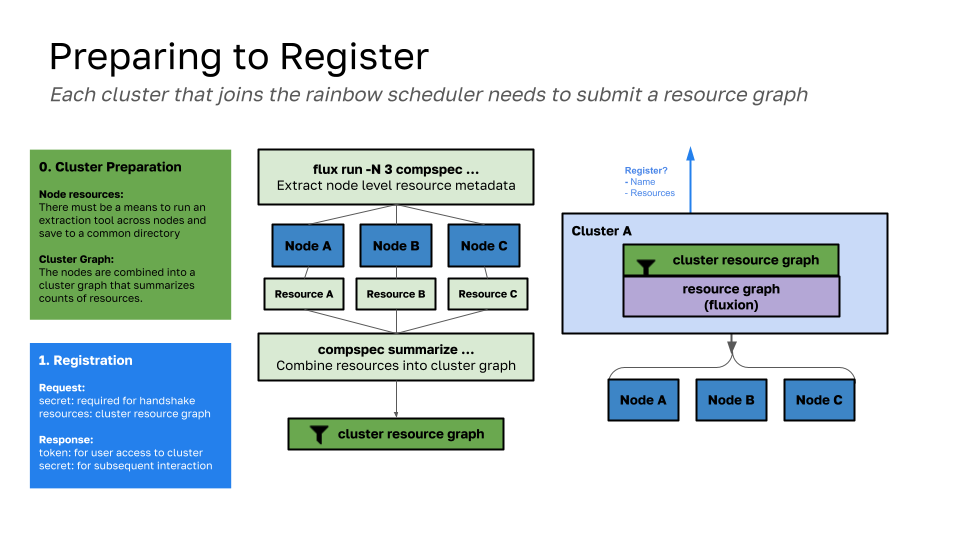
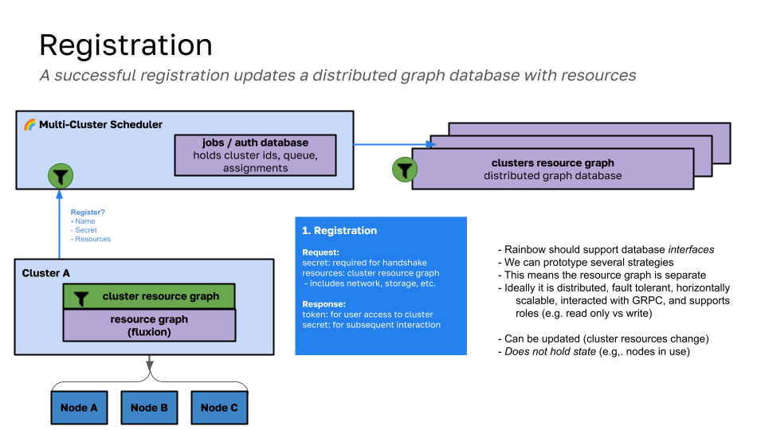
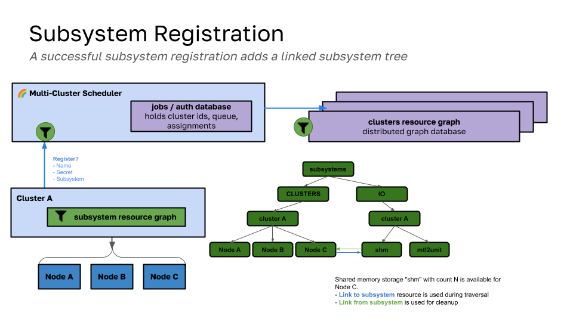
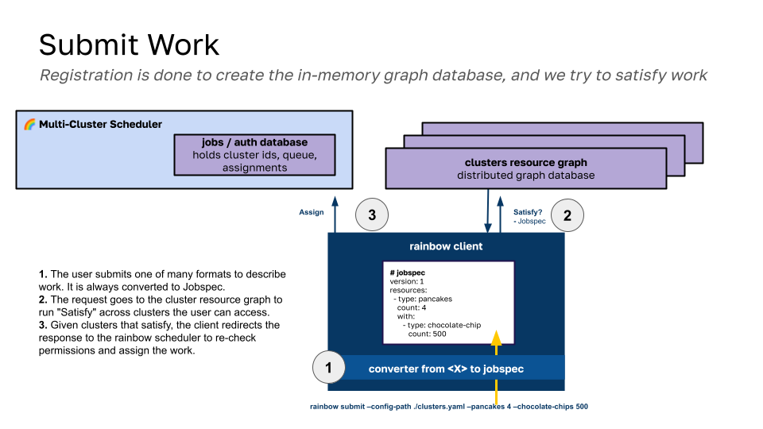
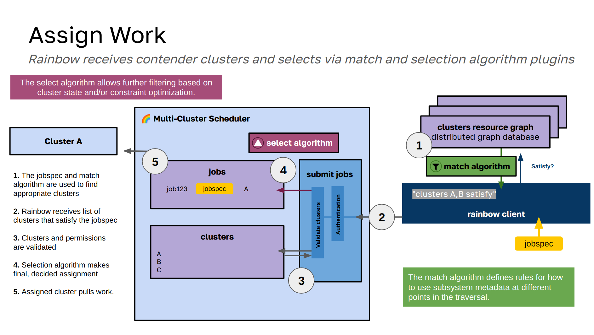

# Designs

## Rainbow Scheduler

### 1. Prepare to Register

To register to the rainbow scheduler, a cluster needs to prepare a JGF graph (json graph format, version 2) of its nodes. While this can be done with any method suitable to the cluster, we have an [extract command](https://github.com/compspec/compspec-go/tree/main/docs/rainbow#example) in compspec that is able to run on each node and then combine the extracted metadata into one. This process is shown in the diagram above in the middle section with `flux run -N3 compspec...` to represent running this command across a few nodes. The result is the cluster resource graph.

This cluster resource graph can then be given to rainbow, which should validate it, and then read it into the graph database. Note that the graph databases in rainbow are interfaces, meaning that multiple can be supported, and it comes down to changing a string for the setting in the configuration file used to start the server.

### 2. Registration

This image extends the first one to show the relationship between rainbow and the graph database. While rainbow receives the registration request and adds the cluster to its small database, the actual graph database that holds the nodes is separate and distributed. Currently this means that graph database interfaces must implement functions that support interaction with the database via GRPC and similar. Currently, since the in-memory graph database (default) is served by rainbow, although it is also exposed via GRPC, it is technically speaking running on the same server, and thus handling authentication. For future, more robust graph databases, in that the rainbow client is interacting directly with them via GRPC (and no rainbow server interaction) we will need to have authentication and authorization represented there. Note that during registration, two things are returned to the cluster:

- **token**: is a token that allows someone to submit work to the cluster. More specifically, someone doing a submit request from anywhere else can provide this token, and the cluster it is associated with can be considered
- **secret**: is a secret that is required for further interaction of the cluster with rainbow, which currently includes accepting jobs and registering subsystems.

This steps also stores summary metrics for the cluster at the top level of the graph (e.g., total nodes, cores) as a "quick check" hieuristic for the search. We don't have to search clusters that can't satisfy the total resources from the get go.

### 3. Subsystem Registration

A subsystem registration is similar conceptually to a regular registration, except we assume the cluster dominant subsystem (the cluster and nodes) to already exist, and thus require the secret In this step. In the same way that summary metrics are kept for the cluster, summary metrics are kept for the subsystem. For a subsystem, we require that every node in the subsystem is either related to another subsystem vertex, OR that it references a vertex in the dominant subsystem (e.g., a physical node has some IO available). We currently keep them under separate roots (e.g., dominant subsystem is "cluster" and clusters like "Cluster A" goes off of that, as shown above) and then the io subsystem has its own root (also with "Cluster A") and those are connected via edges.

The connections (edges) between dominant subsystem and subsystem nodes are bidirectional, and this is done for two reasons:

1. When traversing the dominant subsystem looking for matches, we rely on the edges that point to the subsystem resource to determine if a need is satisfied.
2. The opposite edge is (will be, not implemented yet) used for a cleanup, or going through the subsystem graph, finding nodes that are linked to, deleting the opposing edge, and then the entire subsystem graph.

### 4. Submit Work

Submitting work comes down to the client providing a request, having the request transformed into a Jobspec, and then sent to the cluster resource graph. When we say "transformed into Jobspec" this means that, although the client can provide a jobspec directly with `--jobspec`, it's more likely they will provide another format that can be translated. Formats include (but are not limited to):

- An explicit Jobspec
- A Kubernetes object (not developed yet)
- A simple definition of nodes, cores, gpus, and a command

We likely will be designing other abstractions to define the work, which is not done yet.  Note that this interaction to find clusters that can satisfy the request is only done between the client and graph database, and this is done intentionally to not stress the rainbow cluster server, which should only handle receiving the final assignments and interaction with clusters. This also means we eventually need authentication just on the level of the graph database, which currently isn't an issue because the in-memory graph databsase is served by rainbow, and although it uses the same "separate GRPC" approach, this means it can use the same check for credentials as rainbow uses. We likely want some ability as well for rainbow to verify that the request was seen/approved by the graph database, but I haven't thought that far yet. This is the step that uses the graph database backend to do traversal and determine if the request can be satisfied by one or more clusters. You can read about algorithms for that [here](algorithms.md).

### 5. Assign Work

When some number of clusters are found, the final request is sent to rainbow, which authenticates the user (1), validates access to the clusters (2), and assigns the work. Assignment is simply saving the Jobspec and cluster in the database (3), to be received by the cluster when it pulls next (4). This next step is called receiving work, and is implemented but does not have a diagram here. It comes down to having an endpoint that the cluster uses to receive jobs, authenticating itself with the secret, and then receiving the full jobs with the jobspecs. It accepts them and sends back a success response for rainbow to remove the record from the database. From this point on, the job is owned by the receiving cluster.

## Details

### Design 2 (current)

> Late February 2024

We next want to add a simple scheduler, meaning that the new user interaction works as follows:

1. The user submits a job or application specification (e.g., run a container with compatibility information, or an application with the same) to the rainbow scheduler.
2. The rainbow scheduler then authenticates the user, and can select a best match from a subset of clusters for which the user has access
  - This requires the user tokens, and eventually something more robust like accounts in a database). - This also requires (finally) a graph in rainbow, making it more of a scheduler
3. The rainbow scheduler then filters down clusters to those that might match.
  - This requires sending over cluster metadata on the register step
4. The clusters respond with Yes/No and ETA or cost to choose from.
5. The job is assigned a cluster (or rejected). If assigned, the cluster queries for it when ready.
 - Akin to before, the cluster can have its own means to select jobs to run from the set assigned to it.

#### Authentication

In more detail, this is what the above means for work:

- Authentication: We need to authenticate the user for *multiple* clusters. We should likely create a token/auth file to do this, that has cluster names and tokens. To start (with testing) the tokens can be the same (shared). Eventually this should be more robust.
- In the server, we have to check all tokens to see if the user has permission. In the future there could be some concept of a cluster group (with one token).

#### Registration

The new flow will be as follows:

- At registration, the cluster also sends over metadata about itself (and the nodes it has). This is going to allow for selection for those nodes. But it needs to be some kind of summary information, maybe across a graph? TODO: start with a spec of nodes, maybe Kubernetes, and summarize counts? Can we also submit a flux job to run compspec extract (across nodes) to generate an initial metadata state?

#### Thinking about Scheduling

What does it mean to request work to run on rainbow?

1. The first step is seeing if the work can be run on a cluster. E.g, if the total sum of nodes / resources isn't enough, we immediately filter it. We can prune out an entire cluster as a hiuristic.
  - High level idea: look for opportunities to prune.
  - There should be a table that summarizes resources.
2. The next step is figuring out when it can be run on each cluster.

I think the best thing to do here would be to add a graph interface, and then allow the user to select which graph to use.
This will allow me to experiment / prototype and switch to Fluxion if needed.

##### Job Submit

- When submitting a job, the user no longer is giving an exact command, but a command + an image with compatibility metadata. The compatibility metadata (somehow) needs to be used to inform the cluster selection.
- At selection, the rainbow schdeuler needs to filter down cluster options, and choose a subset.
 - Level 1: Don't ask, juts choose the top choice and submit
 - Level 2: Ask the cluster for TBA time or cost, choose based on that.
 - Job is added to that queue.

TODO:

- first make config file with multiple secrets for multiple clusters
- then allow specifying to give the config file instead
- then write client function that can read in a graph of nodes (how to generate)?

This first design was a proof of concept that we could submit jobs from a single point to multiple different flux clusters. In that sense, it was mostly a dispatcher (no scheduler) that:

- Exposes an API that can take job requests, where a request is a simple command and resources.
- Clusters can register to it, meaning they are allowed to ask for work.
- Users will submit jobs (from anywhere) to the API, targeting a specific cluster (again, no scheduling here)
- The cluster will run a client that periodically checks for new jobs to run.

This is currently a prototype that demonstrates we can do a basic interaction from multiple places, and obviously will have a lot of room for improvement.
We can run the client alongside any flux instance that has access to this service (and is given some shared secret).

### Design 1: Rainbow Dispatcher

> February 2024

This first design was a proof of concept that we could submit jobs from a single point to multiple different flux clusters. In that sense, it was mostly a dispatcher (no scheduler) that:

- Exposes an API that can take job requests, where a request is a simple command and resources.
- Clusters can register to it, meaning they are allowed to ask for work.
- Users will submit jobs (from anywhere) to the API, targeting a specific cluster (again, no scheduling here)
- The cluster will run a client that periodically checks for new jobs to run.

This is currently a prototype that demonstrates we can do a basic interaction from multiple places, and obviously will have a lot of room for improvement.
We can run the client alongside any flux instance that has access to this service (and is given some shared secret).

### Proof of Concept

We can design a "tiny" setup of a more production setup as a proof of concept. Namely, we want to show that it's possible to submit jobs (from anywhere) that are directed to run on different clusters. We want to untangle this work from requiring specific workflow tools that might add additional toil or error, and direct development in a direction that makes things ultiamtely harder. That should be fairly easy to do I think.

In the above:

- The **"scheduler"** can be thought of like a rabbitmq (or other task) queue, but with bells and whistles, and under our control. It will eventually have a scheduler that has high level information about clusters, but to start is just a simple database and endpoints to support job submission and registration. For registration, a secret is required, and then a cluster-specific token sent back for subsequent requests. This will need to be further hardened but is OK for a dummy proof of concept.
- Any **Flux instance** is allowed to hit the register endpoint and request to register with a specific cluster identifier (A or B in the diagram above) and is required to provide the secret. It receives back a token that can be used for subsequent requests. For this first dummy prototype, we will have a simple loop running in the instance that checks the scheduler for jobs assigned to it.
- Any **standalone client** (including the flux instances themselves) can then submit jobs, and request them to be run on any known cluster. This means that instance A can submit to B (and vice versa) and the standalone client can submit to A or B.

The reason I want to prototype the above is that we will want a simple design to test with additional compatibility metadata, and (when actual scheduler bindings are ready) we can add a basic graph to the scheduler above. As we develop we can harden the endpoints / authentication, etc.

[home](/README.md#rainbow-scheduler)
