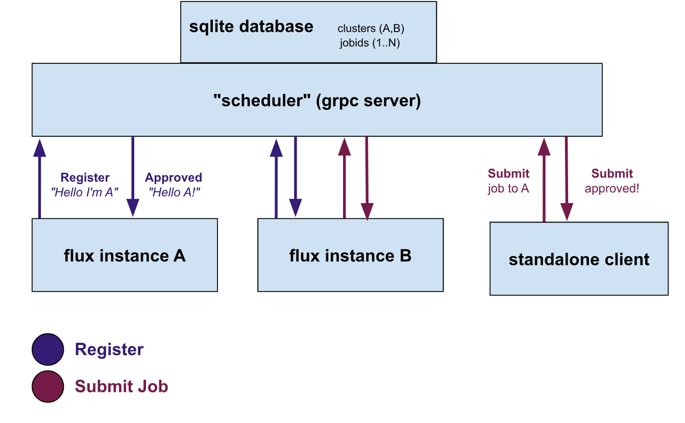

# Designs

## Multi-Cluster Design

> Proof of Concept

We can design a "tiny" setup of a more production setup as a proof of concept. Namely, we want to show that it's possible to submit jobs (from anywhere) that are directed to run on different clusters. We want to untangle this work from requiring specific workflow tools that might add additional toil or error, and direct development in a direction that makes things ultiamtely harder. That should be fairly easy to do I think.

In the above:

- The **"scheduler"** can be thought of like a rabbitmq (or other task) queue, but with bells and whistles, and under our control. It will eventually have a scheduler that has high level information about clusters, but to start is just a simple database and endpoints to support job submission and registration. For registration, a secret is required, and then a cluster-specific token sent back for subsequent requests. This will need to be further hardened but is OK for a dummy proof of concept.
- Any **Flux instance** is allowed to hit the register endpoint and request to register with a specific cluster identifier (A or B in the diagram above) and is required to provide the secret. It receives back a token that can be used for subsequent requests. For this first dummy prototype, we will have a simple loop running in the instance that checks the scheduler for jobs assigned to it.
- Any **standalone client** (including the flux instances themselves) can then submit jobs, and request them to be run on any known cluster. This means that instance A can submit to B (and vice versa) and the standalone client can submit to A or B.

The reason I want to prototype the above is that we will want a simple design to test with additional compatibility metadata, and (when actual scheduler bindings are ready) we can add a basic graph to the scheduler above. As we develop we can harden the endpoints / authentication, etc.

### Design 1: Rainbow Dispatcher

> February 2024

This first design was a proof of concept that we could submit jobs from a single point to multiple different flux clusters. In that sense, it was mostly a dispatcher (no scheduler) that:

- Exposes an API that can take job requests, where a request is a simple command and resources.
- Clusters can register to it, meaning they are allowed to ask for work.
- Users will submit jobs (from anywhere) to the API, targeting a specific cluster (again, no scheduling here)
- The cluster will run a client that periodically checks for new jobs to run.

This is currently a prototype that demonstrates we can do a basic interaction from multiple places, and obviously will have a lot of room for improvement.
We can run the client alongside any flux instance that has access to this service (and is given some shared secret).

[home](/README.md#rainbow-scheduler)