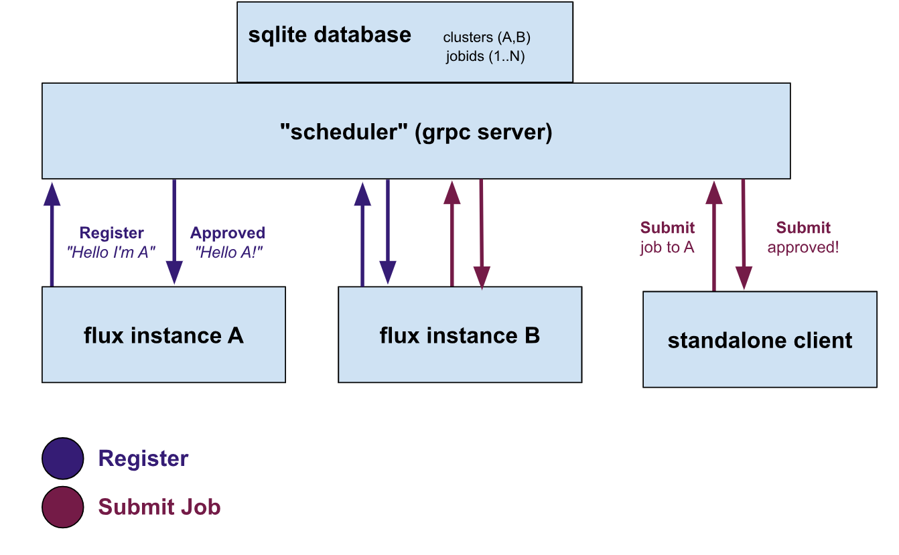

# Early Designs

These are notes from previous designs.

## Design 2 (current)

> Late February 2024

We next want to add a simple scheduler, meaning that the new user interaction works as follows:

1. The user submits a job or application specification (e.g., run a container with compatibility information, or an application with the same) to the rainbow scheduler.
2. The rainbow scheduler then authenticates the user, and can select a best match from a subset of clusters for which the user has access
  - This requires the user tokens, and eventually something more robust like accounts in a database). - This also requires (finally) a graph in rainbow, making it more of a scheduler
3. The rainbow scheduler then filters down clusters to those that might match.
  - This requires sending over cluster metadata on the register step
4. The clusters respond with Yes/No and ETA or cost to choose from.
5. The job is assigned a cluster (or rejected). If assigned, the cluster queries for it when ready.
 - Akin to before, the cluster can have its own means to select jobs to run from the set assigned to it.

### Authentication

In more detail, this is what the above means for work:

- Authentication: We need to authenticate the user for *multiple* clusters. We should likely create a token/auth file to do this, that has cluster names and tokens. To start (with testing) the tokens can be the same (shared). Eventually this should be more robust.
- In the server, we have to check all tokens to see if the user has permission. In the future there could be some concept of a cluster group (with one token).

### Registration

The new flow will be as follows:

- At registration, the cluster also sends over metadata about itself (and the nodes it has). This is going to allow for selection for those nodes. But it needs to be some kind of summary information, maybe across a graph? TODO: start with a spec of nodes, maybe Kubernetes, and summarize counts? Can we also submit a flux job to run compspec extract (across nodes) to generate an initial metadata state?

### Thinking about Scheduling

What does it mean to request work to run on rainbow?

1. The first step is seeing if the work can be run on a cluster. E.g, if the total sum of nodes / resources isn't enough, we immediately filter it. We can prune out an entire cluster as a hiuristic.
  - High level idea: look for opportunities to prune.
  - There should be a table that summarizes resources.
2. The next step is figuring out when it can be run on each cluster.

I think the best thing to do here would be to add a graph interface, and then allow the user to select which graph to use.
This will allow me to experiment / prototype and switch to Fluxion if needed.

#### Job Submit

- When submitting a job, the user no longer is giving an exact command, but a command + an image with compatibility metadata. The compatibility metadata (somehow) needs to be used to inform the cluster selection.
- At selection, the rainbow schdeuler needs to filter down cluster options, and choose a subset.
 - Level 1: Don't ask, just choose the top choice and submit
 - Level 2: Ask the cluster for TBA time or cost, choose based on that.
 - Job is added to that queue.

In practice this meant:

- making a config file with multiple secrets for multiple clusters
- then allow specifying to give the config file instead
- then write client function that can read in a graph of nodes (how to generate)?

This first design was a proof of concept that we could submit jobs from a single point to multiple different flux clusters. In that sense, it was mostly a dispatcher (no scheduler) that:

- Exposes an API that can take job requests, where a request is a simple command and resources.
- Clusters can register to it, meaning they are allowed to ask for work.
- Users will submit jobs (from anywhere) to the API, targeting a specific cluster (again, no scheduling here)
- The cluster will run a client that periodically checks for new jobs to run.

This is currently a prototype that demonstrates we can do a basic interaction from multiple places, and obviously will have a lot of room for improvement.
We can run the client alongside any flux instance that has access to this service (and is given some shared secret).

## Design 1: Rainbow Dispatcher

> February 2024

This first design was a proof of concept that we could submit jobs from a single point to multiple different flux clusters. In that sense, it was mostly a dispatcher (no scheduler) that:

- Exposes an API that can take job requests, where a request is a simple command and resources.
- Clusters can register to it, meaning they are allowed to ask for work.
- Users will submit jobs (from anywhere) to the API, targeting a specific cluster (again, no scheduling here)
- The cluster will run a client that periodically checks for new jobs to run.

This is currently a prototype that demonstrates we can do a basic interaction from multiple places, and obviously will have a lot of room for improvement.
We can run the client alongside any flux instance that has access to this service (and is given some shared secret).

### Proof of Concept

We can design a "tiny" setup of a more production setup as a proof of concept. Namely, we want to show that it's possible to submit jobs (from anywhere) that are directed to run on different clusters. We want to untangle this work from requiring specific workflow tools that might add additional toil or error, and direct development in a direction that makes things ultiamtely harder. That should be fairly easy to do I think.

In the above:

- The **"scheduler"** can be thought of like a rabbitmq (or other task) queue, but with bells and whistles, and under our control. It will eventually have a scheduler that has high level information about clusters, but to start is just a simple database and endpoints to support job submission and registration. For registration, a secret is required, and then a cluster-specific token sent back for subsequent requests. This will need to be further hardened but is OK for a dummy proof of concept.
- Any **Flux instance** is allowed to hit the register endpoint and request to register with a specific cluster identifier (A or B in the diagram above) and is required to provide the secret. It receives back a token that can be used for subsequent requests. For this first dummy prototype, we will have a simple loop running in the instance that checks the scheduler for jobs assigned to it.
- Any **standalone client** (including the flux instances themselves) can then submit jobs, and request them to be run on any known cluster. This means that instance A can submit to B (and vice versa) and the standalone client can submit to A or B.

The reason I want to prototype the above is that we will want a simple design to test with additional compatibility metadata, and (when actual scheduler bindings are ready) we can add a basic graph to the scheduler above. As we develop we can harden the endpoints / authentication, etc.

[home](/README.md#rainbow-scheduler)
